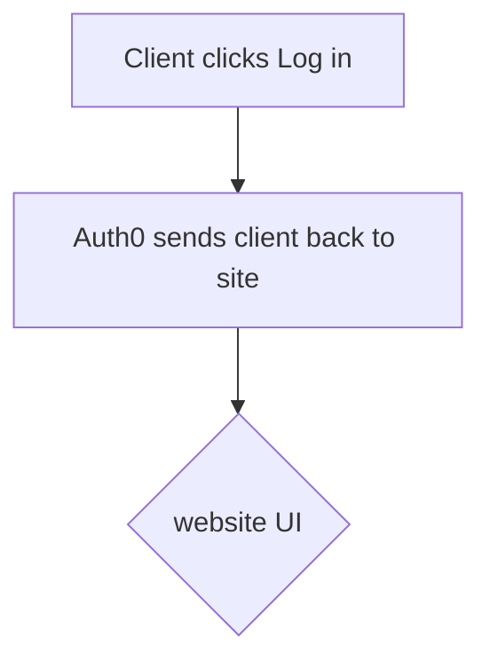
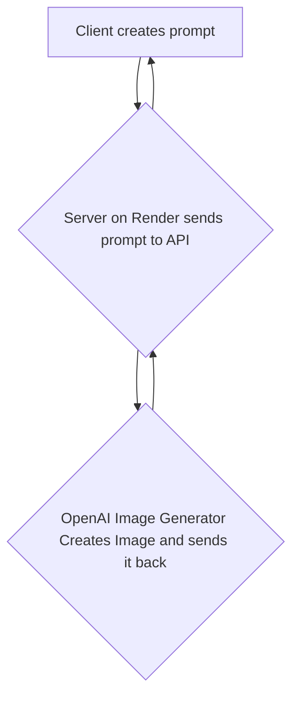
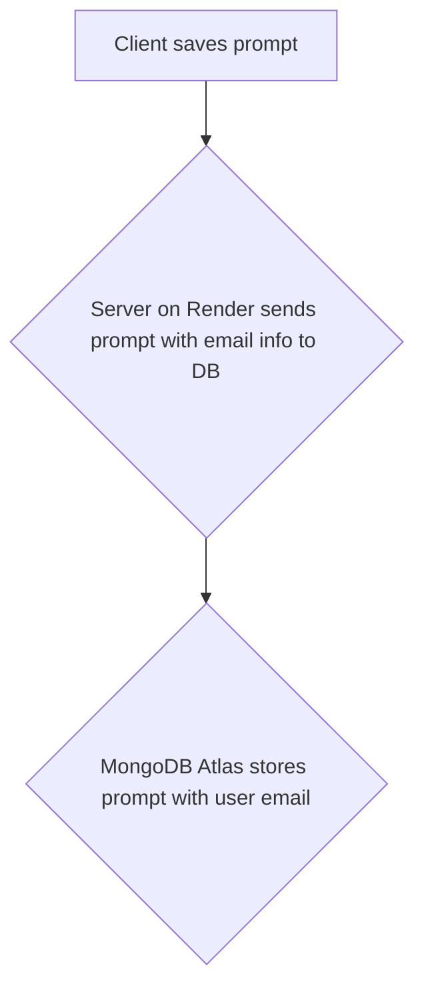
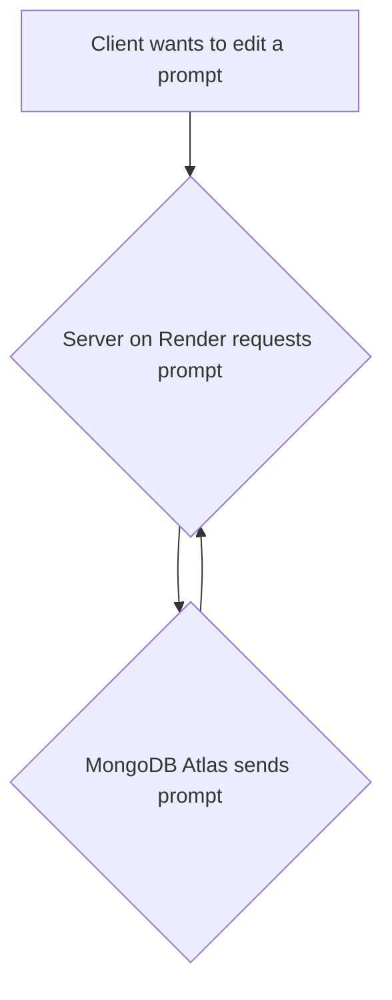

# Open AI Image General

Code Name: OpenImg

## Summary of idea:

User will be able to use image generator API to create custom image using words.

What problem or pain point does it solve? a. Keep it high level without going into too much detail. (3-4 sentences is enough)
Art for people that aren't artist.

Minimum Viable Product (MVP) definition. 
Allows use to save rendered images to the database.

-------------------------------------------------------------------------------------------------------------------------------------------------

1. Logs in
2. Creates Prompt and gets Image back
3. Saves that prompt 
4. Edits that prompt
## Step1 : Client logs in

## Step 2: Client creates a prompt and gets the image based on that

## Step 3: Client saves their prompt to DB

## Step 4: Client updates their prompt

