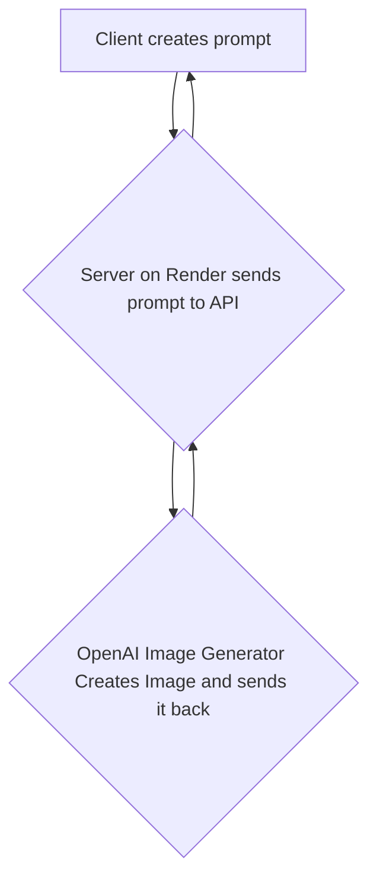
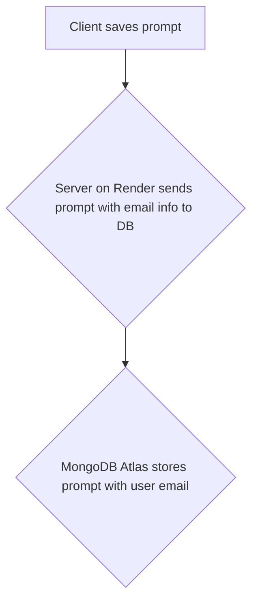
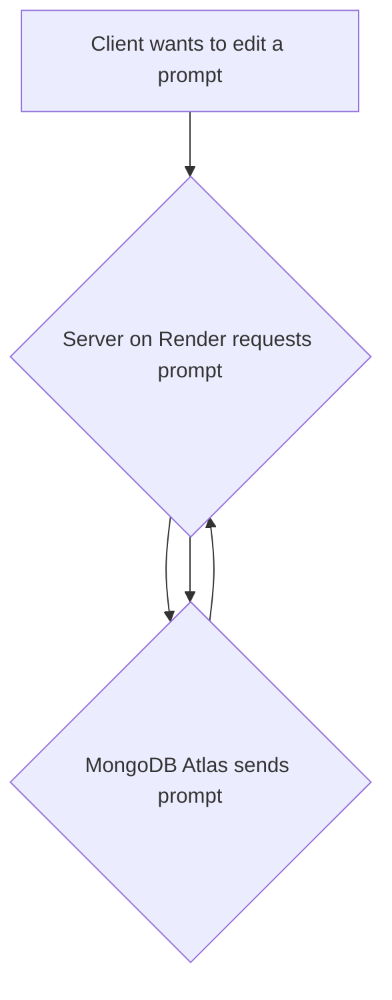

# Open AI Image General

```mermain
flowchart TD
    A[Client clicks Log in] --> B[Client is redirected to Auth0 login];
    B[Auth0 sends client back to site] --> C {website UI};


```mermaid
flowchart TD
    A[Client creates prompt] --> B{Server on Render sends prompt to API};
    B --> C{OpenAI Image Generator Creates Image and sends it back};
    C --> B;
    B --> A;
```


```mermaid
flowchart TD
    A[Client saves prompt] --> B{Server on Render sends prompt with email info to DB};
    B --> C{MongoDB Atlas stores prompt with user email};
```


```mermaid
flowchart TD
    A[Client wants to edit a prompt] --> B{Server on Render requests prompt};
    B --> C{MongoDB Atlas sends prompt};
    C[Client Updates Prompt] --> B{Server on Render requests prompt};
    B --> C{MongoDB Atlas sends prompt};
```