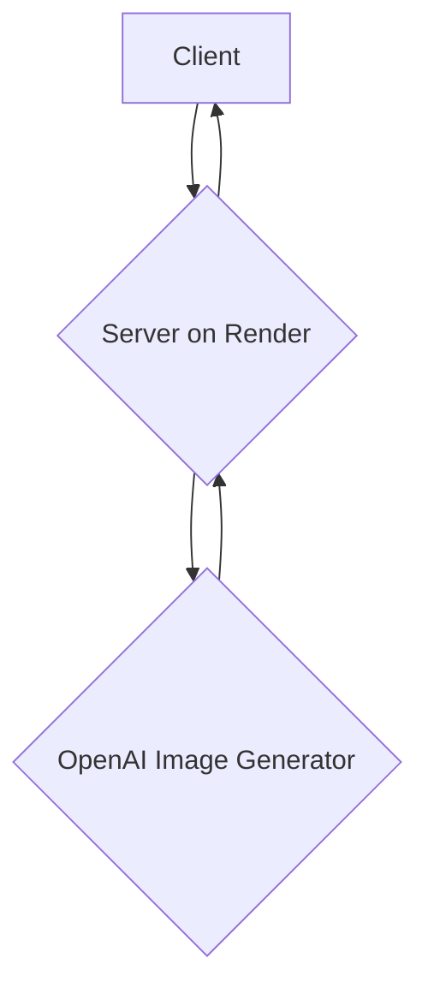
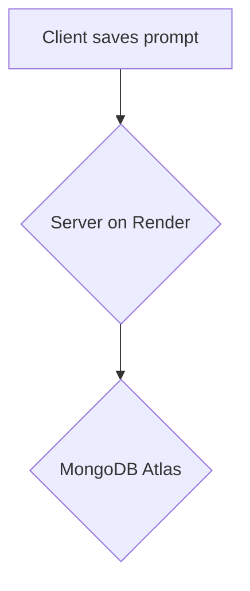
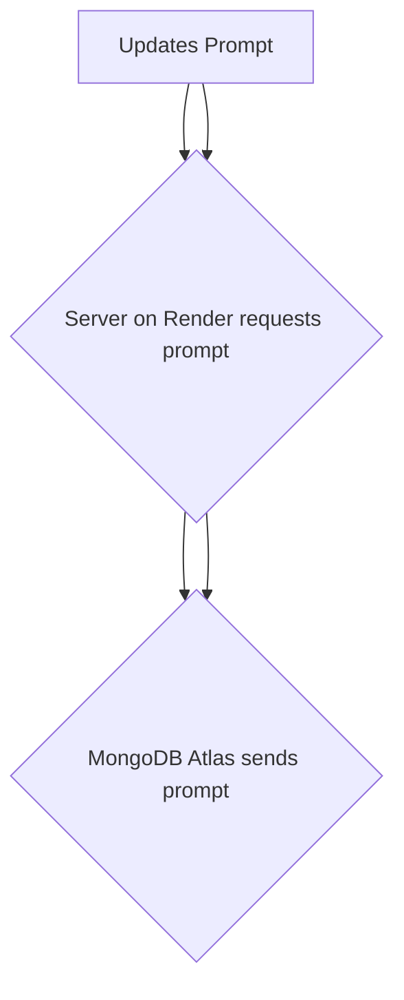

# Open AI Image General

```mermaid
flowchart TD
    A[Client] --> B{Server on Render};
    B --> C{OpenAI Image Generator};
    C --> B;
    B --> A;
```

```mermaid
flowchart TD
    A[Client saves prompt] --> B{Server on Render};
    B --> C{MongoDB Atlas};
```

```mermaid
flowchart TD
    A[Client wants to edit a prompt] --> B{Server on Render requests prompt};
    B --> C{MongoDB Atlas sends prompt};
    A[Updates Prompt] --> B{Server on Render requests prompt};
    B --> C{MongoDB Atlas sends prompt};
```