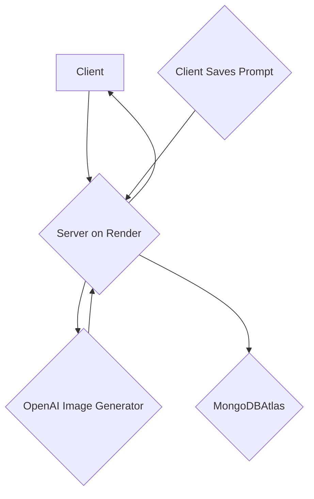

# Open AI Image General

```mermaid
flowchart TD
    A[Client] --> B{Server on Render};
    B --> C{OpenAI Image Generator};
    C --> B;
    B --> A;
    D{Client Saves Prompt} --> B
    B --> E{MongoDBAtlas}
```